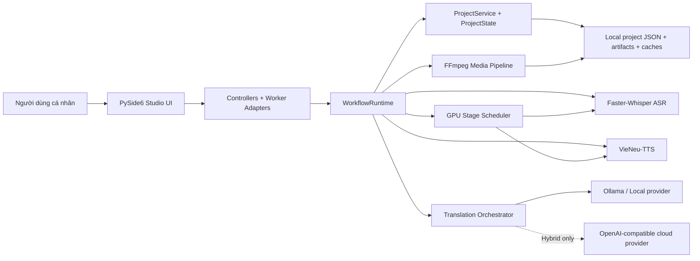
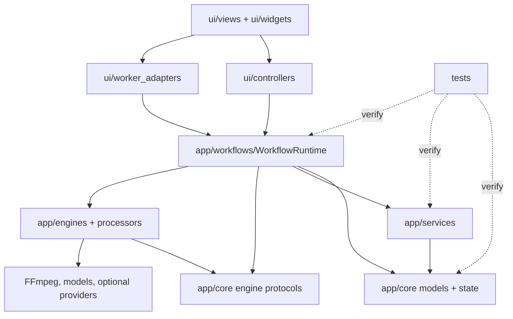
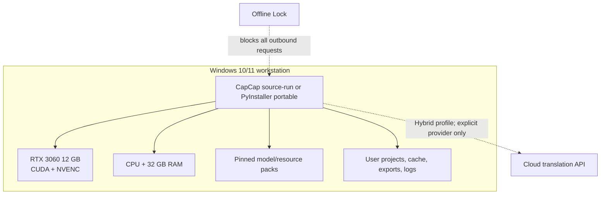
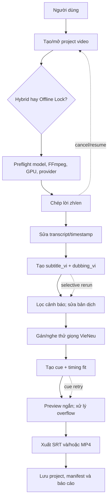

# CapCap — Architecture

## System overview

CapCap remains a modular Windows desktop application. PySide6 owns presentation and user interaction; worker adapters hand immutable requests to application workflows; domain state and engine contracts stay independent of widgets; concrete ASR, translation, TTS and FFmpeg adapters sit at the boundary. A single GPU scheduler serializes heavy inference on the RTX 3060 12 GB.

**Diagram source:** `.viepilot/architecture/system-overview.mermaid`



## ViePilot organization context

- Active profile: `personal`
- Binding: `.viepilot/META.md`
- Source: `~/.viepilot/profiles/personal.md`
- Product language: Vietnamese; local-first privacy, accuracy and speed; technical controls under Advanced.
- Legal rule: retain code/model/voice attribution; do not merge GPL code into the Apache core; voice cloning requires consent.

## Architecture diagram applicability

Complexity is **complex**: more than five modules, event-driven background work, a multi-stage media pipeline, local model runtimes and optional network integrations.

| Diagram type | Status | Reason |
|---|---|---|
| system-overview | required | Clarifies desktop layers, engine boundaries and local/optional-cloud split. |
| data-flow | required | Three text representations and generated media must remain traceable. |
| event-flows | required | QThread progress, cancellation, retry and persistence are correctness concerns. |
| module-dependencies | required | Existing UI/workflow/service/engine boundaries must be preserved during stabilization. |
| deployment | optional | Single-machine deployment is simple but GPU, resource packs and Offline Lock need an explicit view. |
| user-use-case | required | The reviewable pipeline spans six screens and multiple quality gates. |

## Components and boundaries

| Component | Responsibility | Inputs | Outputs / boundary |
|---|---|---|---|
| PySide6 views/widgets | Render six approved workspaces; collect intent; show status/issues | View models, user commands | Signals only; no inference or FFmpeg on GUI thread |
| Controllers/worker adapters | Validate commands, create stage requests, bridge Qt signals | UI intent | Calls application workflows; no domain-rule duplication |
| WorkflowRuntime | Orchestrate prepare, voice and export stages | Stable project ID, options, cancellation | Stage result with artifact paths and provenance |
| ProjectService/ProjectState | Atomic persistence, migrations, signatures, reopen/resume | Canonical segments/settings/artifacts | UTF-8 JSON and file-backed manifests |
| GPUStageScheduler | Exclusive ownership of heavy GPU work | Stage callable | Serialized ASR/TTS execution, telemetry and release |
| ASR adapter | Chinese/English speech recognition | Extracted audio, language, pinned config | Stable timed source segments + confidence/provenance |
| Translation orchestrator | Context translation and dubbing rewrite | Source segments, glossary/style/provider | Separate `subtitle_vi` and `dubbing_vi`; validation flags |
| VieNeu adapter | Audition and cue-level Vietnamese synthesis | `dubbing_vi`, voice profile, timing budget | Valid audio cue or explicit failure |
| Media pipeline | Probe, extract, timing fit, mix, subtitle/mux, export | Local media and generated artifacts | SRT/WAV/MP4 plus ffprobe validation |
| Resource manager | Resolve/pin/check model and binary packs | Resource manifest | Ready/missing/incompatible state, never silent download |

## Canonical segment contract

The current `Segment` model is migrated without losing existing projects. The milestone contract is:

| Field | Rule |
|---|---|
| `id` | Stable and unique across every transformation and reopen. |
| `start`, `end` | Seconds, `0 <= start < end`; editable with validation. |
| `source_language` | Explicit `zh` or `en`; auto only when user selected it. |
| `original_text` | ASR/source text; never overwritten by translation. |
| `subtitle_vi` | Faithful, readable subtitle; independently editable. |
| `dubbing_vi` / `tts_text` | Natural spoken rewrite for the slot; TTS reads this first. |
| `speaker_id`, `voice_profile_id` | Optional mapping with visible fallback. |
| `confidence`, `qa_flags` | ASR/translation/timing issues surfaced for review. |
| `provenance` | Engine/provider, model/revision, prompt/schema version and input signature per stage. |
| `status` | Not started, queued, running, needs review, done, blocked/error. |

## Data flow

**Diagram source:** `.viepilot/architecture/data-flow.mermaid`

```mermaid
flowchart LR
  V["Local video"] --> P["Probe + input fingerprint"]
  P --> A["Extract audio"]
  A --> S["ASR zh/en"]
  S --> O["original_text + timestamps + confidence"]
  O --> SV["Translate subtitle"]
  O --> DV["Rewrite dubbing"]
  SV --> SUB["subtitle_vi"]
  DV --> DUB["dubbing_vi"]
  SUB --> REVIEW["Manual quality gate"]
  DUB --> REVIEW
  REVIEW --> SRT["UTF-8 SRT"]
  REVIEW --> VT["VieNeu cue synthesis"]
  VT --> FIT["Timing fit 0.92–1.12x"]
  FIT --> MIX["Mix voice + background"]
  MIX --> EXP["Single-pass MP4 export"]
  SRT --> EXP
  EXP --> REP["Manifest + benchmark/report evidence"]
```



### Event flows

**Diagram source:** `.viepilot/architecture/event-flows.mermaid`

```mermaid
sequenceDiagram
  actor User
  participant UI as Qt main thread
  participant Worker as QThread worker
  participant Runtime as WorkflowRuntime
  participant Engine as Stage engine
  participant State as ProjectState
  User->>UI: Start or resume stage
  UI->>Worker: Queue immutable stage request
  Worker->>Runtime: Execute stage
  Runtime->>State: Mark running + signature
  Runtime->>Engine: Run with cancellation token
  loop progress
    Engine-->>Worker: Progress/status
    Worker-->>UI: Queued signal
  end
  alt success
    Engine-->>Runtime: Artifact + provenance
    Runtime->>State: Atomic save; mark needs_review/done
    Worker-->>UI: Result signal
  else cancellation/error
    Engine-->>Runtime: Cancelled or actionable error
    Runtime->>State: Preserve prior artifacts; record state
    Worker-->>UI: Cancelled/error signal
  end
```

### Module dependencies

**Diagram source:** `.viepilot/architecture/module-dependencies.mermaid`



Dependency direction is inward. Engines may implement core protocols; core must not import UI or concrete engines. Controllers do not manipulate JSON directly. UI worker classes are adapters, not business workflows.

### Deployment

Status: **optional, generated** because local resource readiness is operationally important.

**Diagram source:** `.viepilot/architecture/deployment.mermaid`



### User use-case

**Diagram source:** `.viepilot/architecture/user-use-case.mermaid`



## Persistence and cache

- The authoritative store is local UTF-8 JSON plus artifacts; there is no database in the 21-day scope.
- Save by writing a sibling temporary file, flushing it, then replacing the target atomically. Keep a recoverable previous version when migrating schema.
- Every artifact records an input fingerprint and dependency signature. A cache hit is valid only when source fingerprint, stable segment ID/text, provider or engine, model/revision, prompt/schema version, language, voice/style/speed and normalizer version match.
- Editing a cue invalidates only that cue and dependent TTS/mix/export artifacts. Changing mix volumes must not invalidate TTS.
- Project reopen must preserve confirmed manual text and speaker/voice assignments.

## Technology decisions

| Decision | Choice | Rationale | Rejected/deferred |
|---|---|---|---|
| Desktop stack | Python 3.11 + PySide6 | Existing application and fast Windows delivery | Web rewrite |
| ASR | Faster-Whisper/CTranslate2 primary | Proven local GPU path for zh/en | SenseVoice benchmark only; FunASR later |
| Translation | Hybrid provider default; Offline Lock option | Accuracy and schedule protection | Cloud-only or forced local-only default |
| Vietnamese TTS | VieNeu-TTS v3 Turbo | Vietnamese quality, local operation, current integration | OmniVoice production deferred |
| Media | FFmpeg/ffprobe; NVENC then libx264 fallback | One validated export path | Multiple re-encode stages |
| Concurrency | QThread workers + signals; one heavy GPU stage | Responsive UI and bounded 12 GB VRAM | Uncontrolled parallel GPU inference |
| Persistence | Versioned local JSON/manifests | Personal app, resumable and inspectable | Database/Kafka |
| Packaging | PyInstaller spec + separate resource manifests | Windows portable/source-run delivery | Large opaque all-in-one installer |
| Integration strategy | Clean-room best-of-breed patterns | Learn from peers while preserving architecture/licenses | Merging/forking entire competitor codebases |

## UI architecture and page coverage

Root `design.md` is authoritative for tokens and interaction language. The six-page direction maps to existing PySide6 surfaces; implementation is incremental, not a framework conversion.

| UI page | PySide6 target | Roadmap |
|---|---|---|
| Launcher | `ui/views/launcher.py` | Phase 1, Task 1.7 |
| Workspace | `ui/views/main_window.py`, `ui/views/start_panel.py`, `ui/views/preview_panel.py` | Phase 1, Task 1.8 |
| Transcript & Translation | `ui/widgets/subtitle_editor_dialog.py`, `ui/controllers/subtitle_controller.py` | Phase 1, Task 1.9 |
| Voice & Dubbing | `ui/views/start_panel.py`, `ui/widgets/voice_clone_dialog.py`, `app/workflows/voice_workflow.py` | Phase 1, Task 1.10 |
| Resources & Settings | `ui/views/resource_manager.py`, settings in `ui/main_window.py` | Phase 1, Task 1.11 |
| Export & Report | `ui/controllers/preview_controller.py`, `app/workflows/export_workflow.py` | Phase 1, Task 1.12; Phase 3, Task 3.4 |

## Security and privacy

- Offline Lock rejects network-capable adapters before execution and is tested with outbound requests disabled.
- API credentials stay in environment/user settings, never logs/project exports/source control.
- The optional remote API binds locally by default and requires `X-CapCap-Token` when enabled; it is compatibility-only for this milestone.
- Validate paths, media types, JSON sizes and base64 payload bounds before remote or subprocess work.
- Voice cloning requires affirmative consent and a recorded asset license; it is not a default batch behavior.

## Observability and failure handling

- Structured stage log: project/run ID, stage, segment count, provider/model revision, cache hit/miss, duration, peak RAM/VRAM, result; redact text/API secrets by default.
- UI shows queued/running/needs-review/done/blocked-error with actionable next step.
- Cancellation acknowledged under one second and worker targeted to stop within five seconds; prior successful artifacts remain valid.
- Export success requires ffprobe validation, not file existence alone.

## Architecture assumptions to benchmark

- CPU model is unknown: record it automatically in benchmark reports.
- Primary cloud translation provider is not yet locked: Task 1.4 benchmarks/configures one primary and one fallback without changing the provider contract.
- Main media type and number of speakers are unknown: the golden set covers one-speaker and multi-speaker/noisy cases; single-actor dubbing is the Week 1 acceptance baseline.
- Architecture was generated from the fully read brainstorm and UI Direction without a separate architect workspace; these assumptions become measured tasks, not blockers.
